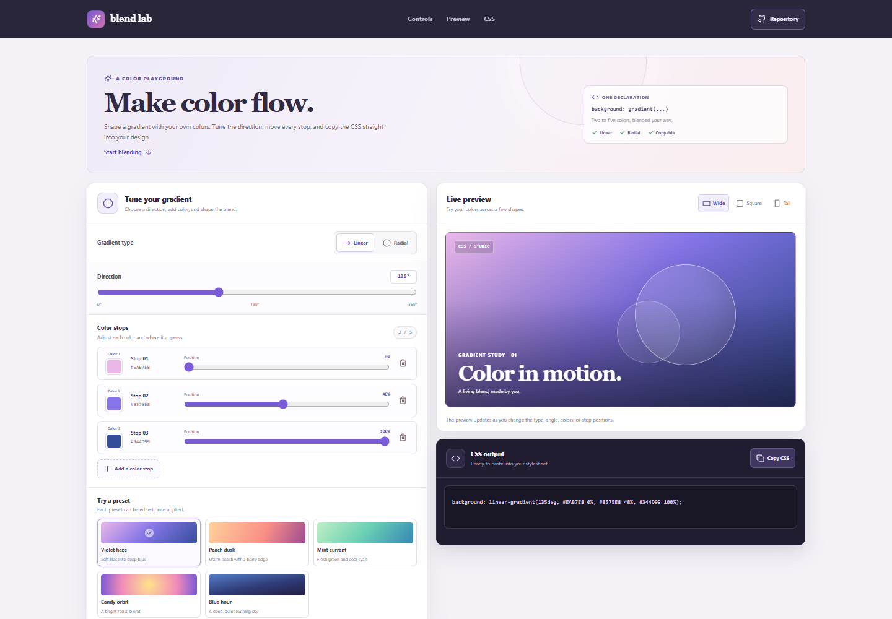

# CSS Gradient Maker

Blend Lab is a browser-based CSS gradient editor. Set up a linear or radial blend, refine its color stops, preview it in different shapes, and copy the finished CSS declaration.

**Live app:** [https://a2rp.github.io/css-gradient-maker/](https://a2rp.github.io/css-gradient-maker/)

## How to use it

Choose a preset or start with the current gradient. Select **Linear** to adjust its angle or **Radial** to make a centered circular blend. Change any stop with its color picker and position slider. Add stops up to five, or remove a stop after confirming the change. The preview and CSS output update as you edit. Choose **Copy CSS** to copy the complete `background` declaration for a stylesheet.

The preview can use a wide, square, or portrait canvas. These options change the shape of the sample canvas while keeping the same gradient.

## What is included

- A fixed header with links to the controls, preview, and generated CSS, plus a link to the source repository.
- Five curated starting points: Violet haze, Peach dusk, Mint current, Candy orbit, and Blue hour.
- Linear and centered radial gradient types.
- A 0 to 360 degree angle slider for linear gradients.
- Two to five editable color stops, each with a hex color picker and a 0 to 100 percent position slider.
- Stops ordered by their position in the gradient. Tied positions are allowed.
- A confirmation dialog before removing a stop. Cancel, Escape, and clicking outside close the dialog without changing the gradient. A gradient always keeps at least two stops.
- A live preview with wide, square, and portrait canvas shapes.
- A copyable CSS declaration that uses the current type, angle, colors, and stop positions.
- A footer with source, portfolio, social, email, and support links, and a back-to-top button after scrolling 50 pixels.

## Data and limits

The editor keeps its current gradient in page state. It does not upload or save gradient settings, so refreshing the page restores the Violet haze preset. Colors use six-digit hex values, and positions and angles use whole-number steps. Radial gradients use a circle centered in the preview. The app does not export image files or retain a gradient library.

## Run locally

```sh
npm install
npm run dev
```

## Check and deploy

```sh
npm run lint
npm test
npm run build
npm run deploy
```

The deploy command builds the app and publishes the `dist` folder to the `gh-pages` branch. The live site is [https://a2rp.github.io/css-gradient-maker/](https://a2rp.github.io/css-gradient-maker/).

## Future improvements

These are ideas that are not implemented yet:

- Save named gradients locally and restore them after a refresh.
- Add conic gradients and editable radial center points.
- Export the preview as an image or shareable file.
- Add a larger searchable library of gradient recipes.

## Links

- Portfolio: [https://www.ashishranjan.net](https://www.ashishranjan.net)
- GitHub: [https://github.com/a2rp](https://github.com/a2rp)
- CodePen: [https://codepen.io/ash1198](https://codepen.io/ash1198)
- LinkedIn: [https://www.linkedin.com/in/aashishranjan](https://www.linkedin.com/in/aashishranjan)
- Facebook: [https://www.facebook.com/theash.ashish/](https://www.facebook.com/theash.ashish/)
- YouTube: [https://www.youtube.com/@ashishranjan-ashz?sub_confirmation=1](https://www.youtube.com/@ashishranjan-ashz?sub_confirmation=1)
- Email: [mailto:ash.ranjan09@gmail.com](mailto:ash.ranjan09@gmail.com)

## Support

- Support: [https://a2rp-donation-page.netlify.app/](https://a2rp-donation-page.netlify.app/)
- Buy Me a Coffee: [https://buymeacoffee.com/ashishranjan](https://buymeacoffee.com/ashishranjan)
- Patreon: [https://www.patreon.com/ashishranjan](https://www.patreon.com/ashishranjan)
